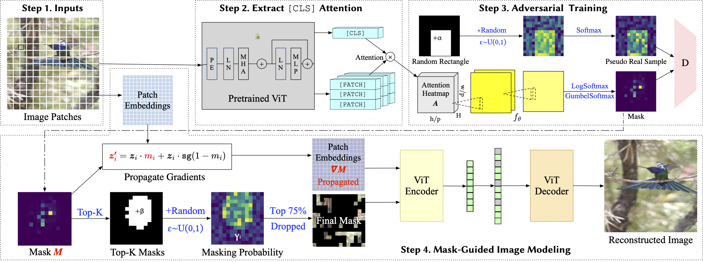

# AutoMAE

<p align="center">
  
</p>

This is a PyTorch/GPU implementation of [Improving Masked Autoencoders by Learning Where to Mask](https://arxiv.org/pdf/2303.06583.pdf). [The repo is a modification on the MAE repo](https://github.com/facebookresearch/mae).

## Prerequisites

* This repo is based on [`timm==0.3.2`](https://github.com/rwightman/pytorch-image-models), for which a [fix](https://github.com/rwightman/pytorch-image-models/issues/420#issuecomment-776459842) is needed to work with PyTorch 1.8.1+.

* We provide a conda environment file `env.yaml` to install dependencies.

    ```bash
    $ conda env create -f env.yaml
    ```

* To speed up data loading in pre-training, we store the dataset into an HDF5 file. You can use `convert_to_hdf5.py` to convert the ImageNet-1k dataset to a single HDF5 file.

## Run pretraining & evaluation scripts

- Use `run_pretrain.sh` to start pre-training on ImageNet. Set `IMAGENET_DIR` as the actual folder of your ImageNet dataset files.

- Use `run_finetune.sh` / `run_linprobing.sh` to start fine-tuning / linear-probing on ImageNet.

## Pretrained models


| Model   | Linear Probing Acc-1 | Finetuning Acc-1 | Link                                                                                           |
|---------|----------------|------------|------------------------------------------------------------------------------------------------|
| AutoMAE(MAE-800) | 66.7           | 83.32      | [GDrive](https://drive.google.com/drive/folders/1S87L2yjIqbES9mNKbKPUg8F23BM5tHO9?usp=sharing) |
